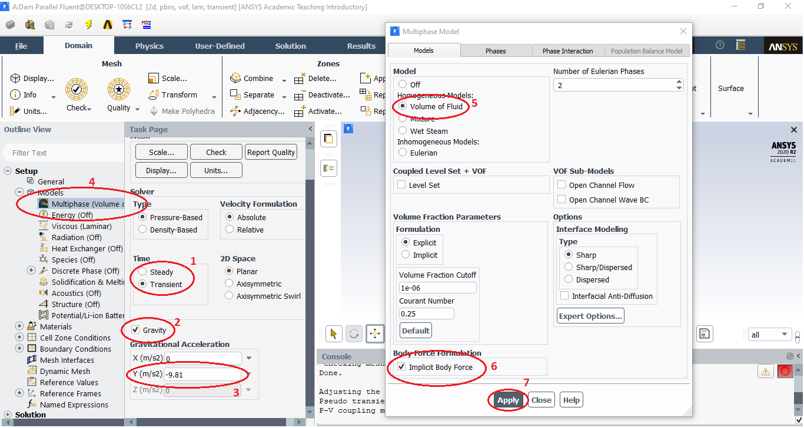

# Simulação Rompimento de Barragem
## Milena Martins Magalhães
## 15/0018711

**Introdução**

Por definição uma barragem é uma estrutura, permanente ou temporária, que tem como objetivo a contenção ou acumulação de água, substâncias líquidas ou de misturas de líquidos e sólidos. As barragens podem ser usadas para geração de energia em usinas hidrelétricas, irrigação, defesa contra inundações, contenção de resíduos industriais e de mineração, entre outras possibilidades.

A construção e operação de barragens podem envolver danos potenciais para a população e para os bens materiais e ambientais existentes no entorno. De acordo com a Agência Nacional de Águas e Saneamento Básico (ANA), hoje no Brasil existem 20.104 barragens dentre elas 1953 barragens são categorizadas como risco alto e 3598 são consideradas barragens de dano potencial associado alto. 

Prezar pela segurança de barragens é um aspecto fundamental para as entidades envolvidas, podendo ser elas públicas ou privadas. Um acidente envolvendo barragens pode trazer um enorme prejuízo financeiro, ambiental e social para todos, e principalmente para a população ao redor da construção. Alguns trágicos eventos já ocorreram no Brasil envolvendo barragens e, por esse motivo, as instituições públicas de fiscalização e regulação atuam com o intuito de prevenir o desgaste de barragens tanto de rejeitos quanto de hidrelétricas, fazendo monitoramento, inspeções e revisões periódicas.

Esse trabalho busca simular, por meio da ferramenta Fluent disponível no software Ansys, um rompimento de barragem com o objetivo de analisar como é o comportamento da estrutura e do fluido (água) durante esse evento.

**Simulação**

Para fazer a simulação será usado uma malha (geometria) pré-definida, o primeiro passo da simulação é mudar as cores relacionadas a cada região seguindo os passos da figura abaixo. 

Depois de feito esses passos você terá a seguinte representação.

Depois disso iremos especificar condições de operação, será selecionado o tipo de regime como transiente e o valor de gravidade usado será de 9,81 m/s^2, de acordo com os passos de 1 a 3 da figura abaixo.

Escolheremos também o método de superfície livre de acordo com os passos 4 a 7.

Agora na guia de materiais iremos definir as propriedades do ar e da água, na figura abaixo é mostrado os passos para criar o elemento água na simulação.

O próximo passo é a definição de qual elemento será a fase primária e qual será a fase secundária. O ar será a fase primária e a água a fase secundária de acordo com a figura abaixo.

A escolha da massa específica de operação será a massa do fluido menos denso, no nosso caso a massa específica da água. Seguindo os passos abaixo coloque o valor de 1.225 kg/m^3 pois esse é o valor da massa específica da água.

Nesse momento serão estabelecidas as condições de contorno, poutlet é uma condição de pressão e de saída e ela será válida apenas para a água, definimos isso seguindo os passos 1 a 3 da figura abaixo, e depois definimos que a fração de volume de escoamento reverso será zero de acordo com os passos 4 a 6.

O próximo passo é a definição dos fatores de relaxação, são fatores que controlam a convergência da simulação além disso é preciso definir também os esquemas de discretização de acordo com os passos abaixo.

Após alterar o valor de pressão para 0.001 é inicializado o caso de forma padrão.

É definido a condição inicial usando a ferramenta "Patch" seguindo os passos de acordo com a figura abaixo. Nela a gente define que a região verde é preenchida totalmente por água.

Para rodar a simulação primeiro é definido um tempo de auto salvamento que será a cada 0.1 passo, essa etapa é mostrada na figura nos passos 1 a 3. Após isso foi definido o passo de tempo e a quantidade de iterações para gerar a simulação de acordo com os passos 4 a 6 abaixo. 

Será simulado variando o número de interações obedecendo a seguinte sequência, 20, 30, 30 e 20 para assim atingir 100 interações. Depois de rodada a simulação será possível ver os resultados alcançados.

**Resultado**

No próprio Fluent é possível fazer uma primeira análise plotando os resultados, na aba Results > Graphics > Vectors onde é selecionado os vetores de velocidade de mistura como é possível ver na figura abaixo. 

Nesse gráfico já é possível observar o fluxo de um rompimento de barragem assim foi esperado.

Usando a ferramenta do CFD Post foi possível analisar de maneira mais clara os resultados da simulação, lá é possível ver o rompimento da barragem e o fluxo de água por meio de gráficos que mostram ocomportamento de diversas variáveis ao longo do rompimento. Foi possível observar o comportamento da pressão e do volume de água nos momentos iniciais e finais do rompimento. A seguir será apresentado as figuras do resultado.

No gráfico de pressão, figura acima, foi observado que após o rompimento existe um aumento de pressão no volume de água que flui pelo rompimento.

No gráfico de volume apresentado acima é possível ver exatamente o que se propõe, a massa de água escoa pela barragem rompida e se espalha a jusante da mesma. Mostrando assim que a simulação obteve sucesso no que se esperava. 

**Conclusão**

Essa simulação foi importante para compreender as variáveis entorno do comportamento dos fluidos em um evento como esse. Foi possível entender melhor o nível de detalhamento que o software pode trazer para uma simulação desse porte e como é feita a análise dessa simulação, a partir desses resultados foi possível demonstrar um escoamento de água através do rompimento da barragem.  

